# Lập trình Android

Đây là kho lưu trữ (repository) chứa các bài tập thực hành, đồ án nhỏ và mã nguồn trong quá trình học môn **Lập trình thiết bị di động (Android)**.

## Thông tin sinh viên
* **Họ và tên:** Võ Huỳnh Kim Chi
* **Mã sinh viên:** 65130306

---

## Giới thiệu về Lập trình Android
Android là hệ điều hành di động phổ biến nhất thế giới dựa trên nhân Linux. Việc phát triển ứng dụng Android thường sử dụng ngôn ngữ **Kotlin** (được Google khuyến nghị hiện nay) hoặc **Java**, kết hợp với **XML** hoặc **Jetpack Compose** để xây dựng giao diện người dùng.

---

## Cấu trúc học Android cơ bản (Lộ trình)
Kho lưu trữ này được xây dựng bám sát theo các kiến thức cốt lõi của lập trình Android:

* **Giao diện người dùng (UI):** Xây dựng màn hình với XML (LinearLayout, ConstraintLayout, RecyclerView) hoặc Jetpack Compose hiện đại.
* **Thành phần ứng dụng:** Nắm vững Vòng đời (Lifecycle) của Activity và Fragment.
* **Điều hướng (Navigation):** Sử dụng Intent để chuyển đổi giữa các màn hình và truyền dữ liệu.
* **Lưu trữ dữ liệu (Storage):** Lưu trữ nhẹ với SharedPreferences và quản lý cơ sở dữ liệu cục bộ với Room Database (SQLite).
* **Kết nối mạng (Networking):** Gọi API và tải dữ liệu từ internet sử dụng thư viện Retrofit và xử lý đa luồng (Coroutines/Threads).

---

## Công cụ và Yêu cầu hệ thống
Để mở và biên dịch được các dự án trong kho lưu trữ này, bạn cần có:

1. **IDE:** Trình soạn thảo **Android Studio** (khuyên dùng phiên bản mới nhất).
2. **SDK:** Android SDK (tối thiểu API Level 24 trở lên).
3. **Môi trường chạy:** Máy ảo Android (AVD) tích hợp sẵn trong Android Studio, hoặc thiết bị điện thoại Android thật đã bật chế độ *USB Debugging*.

---

## Bài Tập
### Bài tập Thi Giữa Kỳ (OnTapBott)

[Chi tiết bài tập](thigk2_65130306\app\src\main)

  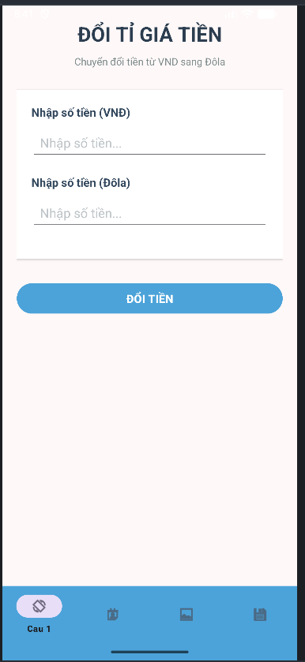
  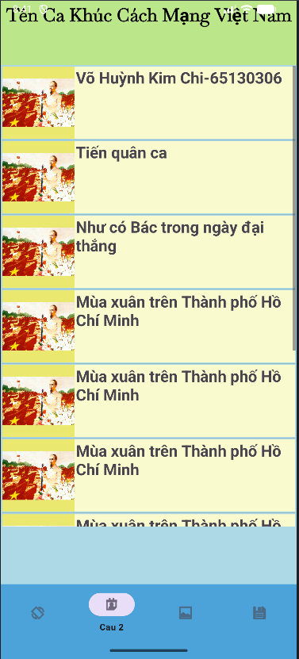
  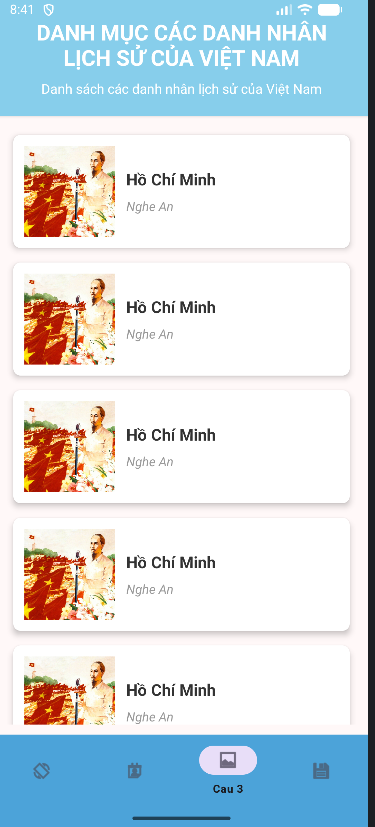
  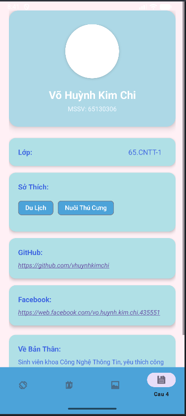

## Bài Tập
### Bài tập Ôn thi Giữa Kỳ (OnTapBott)

[Chi tiết bài tập](OnTapBott/app/src/main/java/kc/edu/ontapbott)

  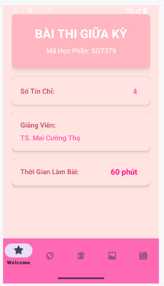
  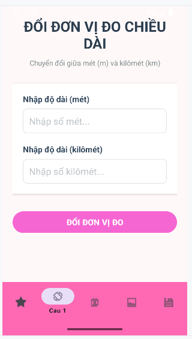
  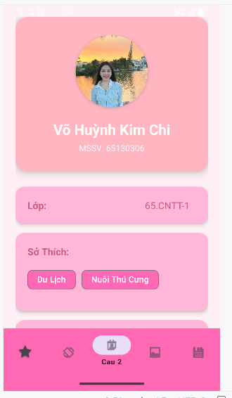
  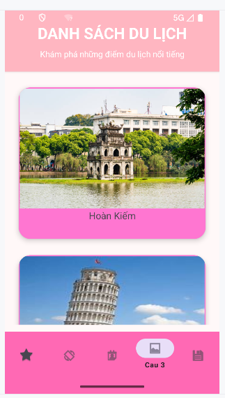
  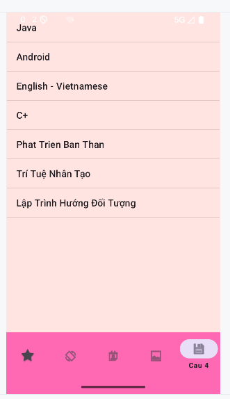

### Bài tập Navigation_Drawer

[Chi tiết bài tập](Navigation_Drawer/app/src/main/java/kc/edu/navigation_drawer)

  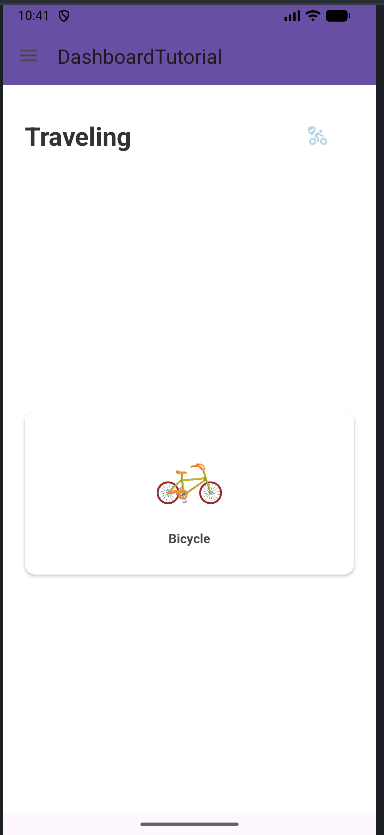
  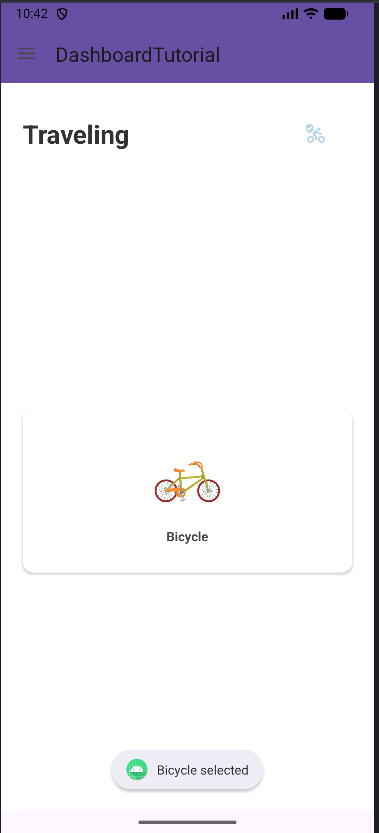
  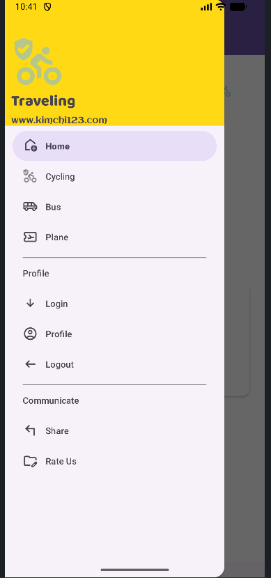
  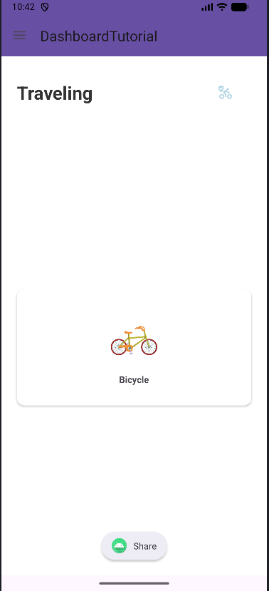
  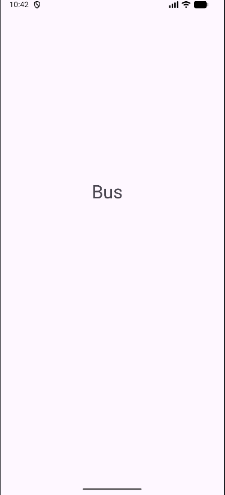

### Bài tập Viewpager2

[Chi tiết bài tập](ViewPager2TabLayoutFragment\app\src\main)

  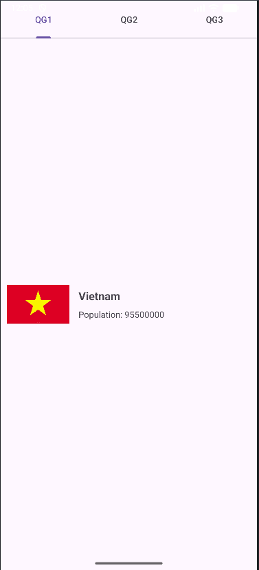
  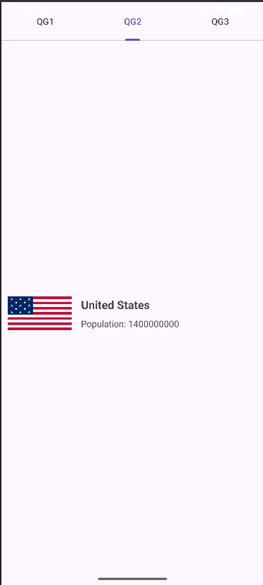
  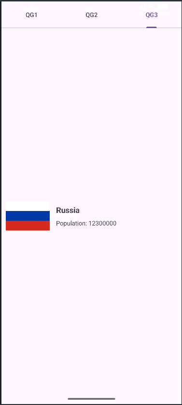

### Bài tập LandScape Viewpager

[Chi tiết bài tập](LandScape_ViewPager\app\src\main)

  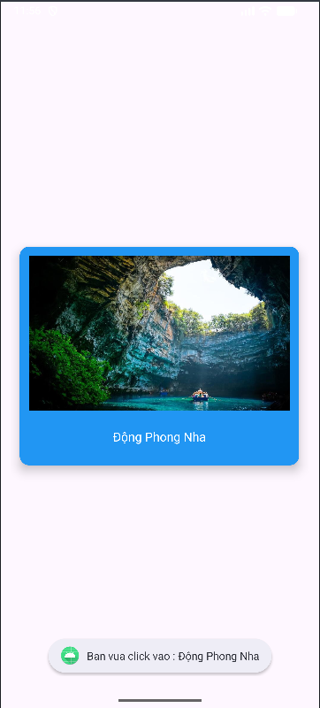
  
  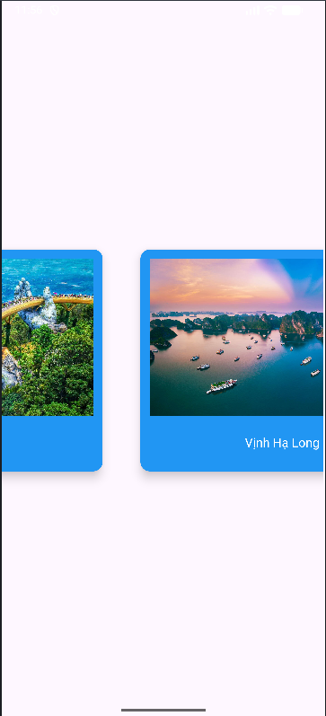

### Bài tập Đọc Báo Tổng Hợp

[Chi tiết bài tập](DocBaoTongHop\app\src\main)

  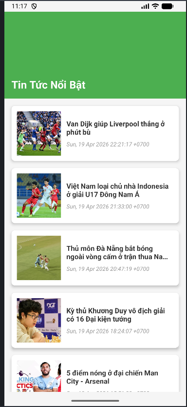

### Bài tập Menu Món Ăn

[Chi tiết bài tập](Menu_Nha_Hang\app\src\main)

  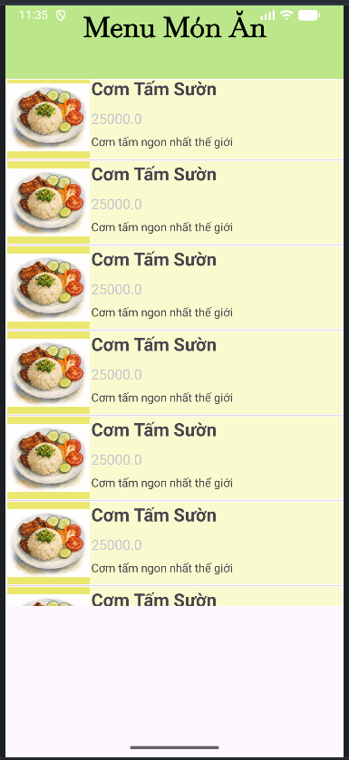

